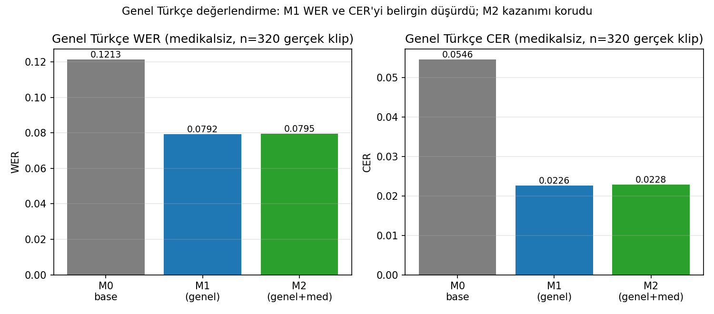
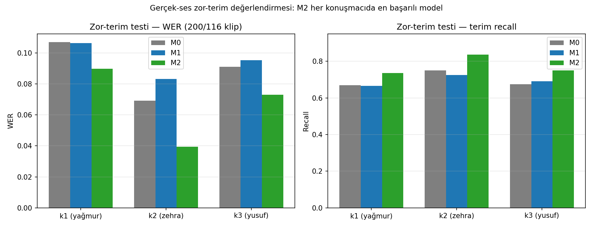

# Sonuçların Özeti

Bu belge, depoda yayımlanan temel sayısal sonuçları ve bunların yorumlanma
sınırlarını özetler. WER sözcük hata oranını, CER karakter hata oranını, RTF ise
işleme süresinin ses süresine oranını ifade eder. Bu üç metrikte daha düşük değer
daha iyidir.

## Model Adlandırması

- **M0:** İnce ayar uygulanmamış `openai/whisper-large-v3`
- **M1:** Genel Türkçe verileriyle LoRA ince ayarı yapılmış model
- **M2:** Genel Türkçe ve tıbbi verilerle ikinci aşama LoRA ince ayarı yapılmış
  model

## Bağımsız Genel Türkçe Değerlendirmesi

| Model | WER | CER | Klip |
|---|---:|---:|---:|
| M0 | 0,1213 | 0,0546 | 320 |
| M1 | 0,0792 | 0,0226 | 320 |
| M2 | 0,0795 | 0,0228 | 320 |

M1, M0'a göre WER'i %34,7 ve CER'i %58,6 göreli olarak azaltmıştır. M2'nin
M1'e çok yakın sonuçları, tıbbi uyarlama yapılırken genel Türkçe başarımının
korunduğunu göstermektedir.

## Bağımsız Gerçek Konuşma Zor Terim Testi

V2 testi eğitim cümlelerinden farklı, toplam 516 gerçek konuşma kaydı içerir.
Terim geri çağırma, referansta bulunan hedef tıbbi terimlerin ASR çıktısında doğru
yakalanma oranıdır; daha yüksek değer daha iyidir.

| Konuşmacı | n | M0 WER | M1 WER | M2 WER | M0 CER | M1 CER | M2 CER | M0 terim geri çağırma | M2 terim geri çağırma |
|---|---:|---:|---:|---:|---:|---:|---:|---:|---:|
| k1 | 200 | 0,1070 | 0,1064 | **0,0898** | 0,0204 | 0,0192 | **0,0177** | 0,670 | **0,735** |
| k2 | 116 | 0,0691 | 0,0831 | **0,0395** | 0,0130 | 0,0151 | **0,0075** | 0,750 | **0,836** |
| k3 | 200 | 0,0911 | 0,0952 | **0,0730** | 0,0142 | 0,0153 | **0,0131** | 0,675 | **0,750** |

M2 üç konuşmacının tamamında en düşük WER'i üretmiş, hedef tıbbi terimlerin geri
çağırma oranını M0'a göre 6,5-8,6 yüzde puanı artırmıştır.

### Eşleştirilmiş Bootstrap Analizi

50.000 tekrar ve `20260610` tohumu ile M0-M2 farkı değerlendirilmiştir.

| Kapsam | n | Ortalama WER farkı | %95 güven aralığı | p |
|---|---:|---:|---:|---:|
| k1 | 200 | 0,0172 | [0,0045; 0,0303] | 0,0076 |
| k2 | 116 | 0,0296 | [0,0137; 0,0468] | 0,0001 |
| k3 | 200 | 0,0181 | [0,0050; 0,0314] | 0,0063 |
| Birleştirilmiş | 516 | 0,0203 | [0,0122; 0,0284] | <0,0001 |

Birleştirilmiş CER farkı 0,0027, %95 güven aralığı [0,0008; 0,0049] ve
p=0,0035'tir. Konuşmacı düzeyinde CER farkı yalnız k2 için anlamlıdır; bu nedenle
CER sonuçları konuşmacı bazında genellenmemelidir.

## Genel Türkçe Model Benchmarkı

Benchmark; Common Voice TR'den 447, ISSAI'den 453 ve OpenSLR TR'den 160 olmak
üzere toplam 1.060 klip içerir. Yirmi modelin her klipte değerlendirilmesiyle
21.200 model-klip satırı üretilmiştir.

| Sıra | Model | WER | CER | RTF | ASCS |
|---:|---|---:|---:|---:|---:|
| 1 | openai/whisper-large-v3 | 0,1345 | 0,0588 | 0,1349 | 0,9571 |
| 2 | vincespeed/faster-whisper-large-v3-turbo-turkish | 0,1825 | 0,0774 | 0,0927 | 0,9534 |
| 3 | Huseyin/whisper-large-v3-turkish-finetuned | 0,1841 | 0,0971 | 0,1587 | 0,9510 |
| 4 | openai/whisper-large-v2 | 0,1901 | 0,0999 | 0,1333 | 0,9498 |
| 5 | openai/whisper-large-v3-turbo | 0,2014 | 0,0897 | **0,0338** | 0,9487 |

Tam tablo [`results/benchmark/leaderboard.csv`](../results/benchmark/leaderboard.csv)
dosyasındadır. ASCS, referans ve hipotez metinlerinin duygu dağılımları arasındaki
benzerliği ölçen AcoSemantic metin bileşenidir; daha yüksek değer daha iyidir.
ASCS tek başına sözcük doğruluğu yerine kullanılmamalı, WER ve CER ile birlikte
yorumlanmalıdır.

## Sentetik Tıbbi Değerlendirme Hakkında Kritik Not

`results/finetune/eval_m*_summary.json` dosyalarındaki 652 satırlık birleşik
değerlendirmenin 332 tıbbi satırı sentetiktir. M2 eğitim sürecinde medv3'ün tüm
3.236 satırı üç kat örneklenerek kullanılmıştır; eğitim betiği veri kümesindeki
nominal eğitim/doğrulama ayrımını filtrelememiştir. Bu nedenle M2'nin sentetik
tıbbi satırlardaki sonucu bağımsız doğrulama veya genelleme kanıtı değildir.

Bu özetler deney denetimi ve sürecin şeffaflığı için korunmuştur. M2'nin tıbbi
başarımı hakkında esas bağımsız kanıt, yukarıda verilen eğitim cümlelerinden
farklı V2 gerçek konuşma zor terim testidir.
